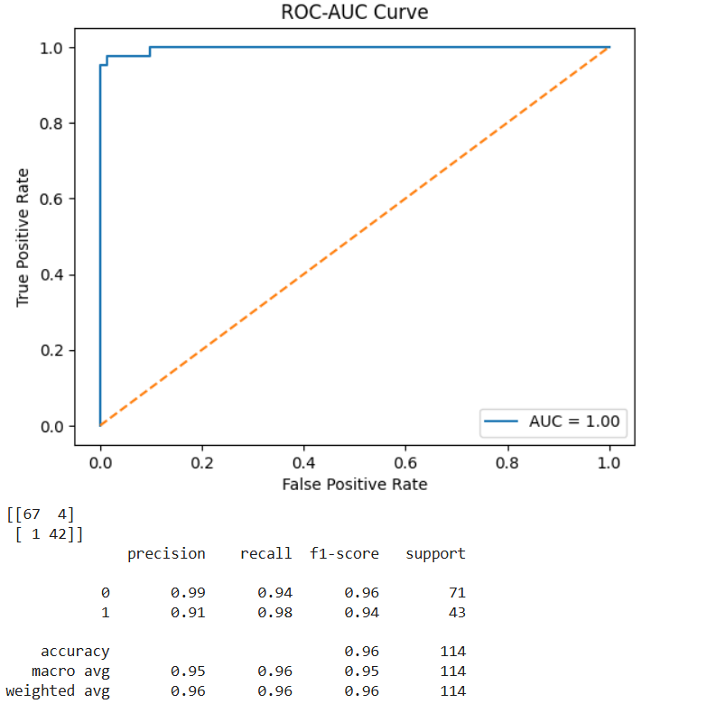

# Task 4: Classification with Logistic Regression

This project is part of the AI & ML Internship program and focuses on building a **binary classifier** using **Logistic Regression** with the **Breast Cancer Wisconsin Dataset**.

---

##  Objective

To build a binary classification model using Logistic Regression, evaluate its performance, and understand key concepts like the sigmoid function and threshold tuning.

---

##  Tools & Libraries

- Python
- Pandas
- Scikit-learn
- Matplotlib
- Seaborn
- NumPy

---

##  Files Included

- `task4.py`: Python script containing all the steps from loading data to evaluation.
- `data.csv`: Dataset used for training and testing.
- `task4-01.png`: Confusion Matrix visualization.
- `task4-02.png`: ROC-AUC Curve.
- `task4-03.png`: Sigmoid Function Plot.
- `README.md`: This file.

---

##  Evaluation Metrics

- **Confusion Matrix**
- **Precision & Recall**
- **F1-Score**
- **ROC-AUC Score**
- **Threshold Tuning**

---

##  Screenshots

### Confusion Matrix

### ROC-AUC Curve

### Sigmoid Function

---

##  Summary

- The model was trained using logistic regression on the Breast Cancer dataset.
- Feature scaling was applied using `StandardScaler`.
- Evaluation was done using confusion matrix, ROC-AUC, and other metrics.
- Custom threshold tuning was also explored.
- Sigmoid function behavior was visualized.

---

##  Dataset Source

[Breast Cancer Wisconsin Dataset - Kaggle](https://www.kaggle.com/datasets/uciml/breast-cancer-wisconsin-data)

---

